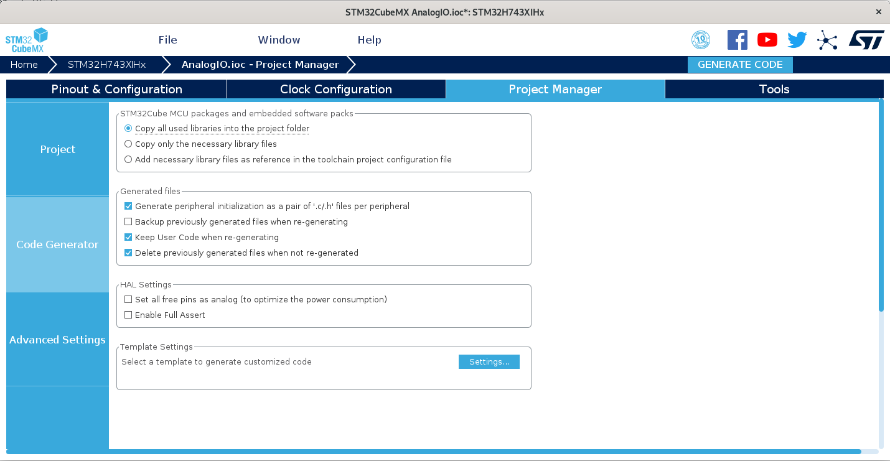
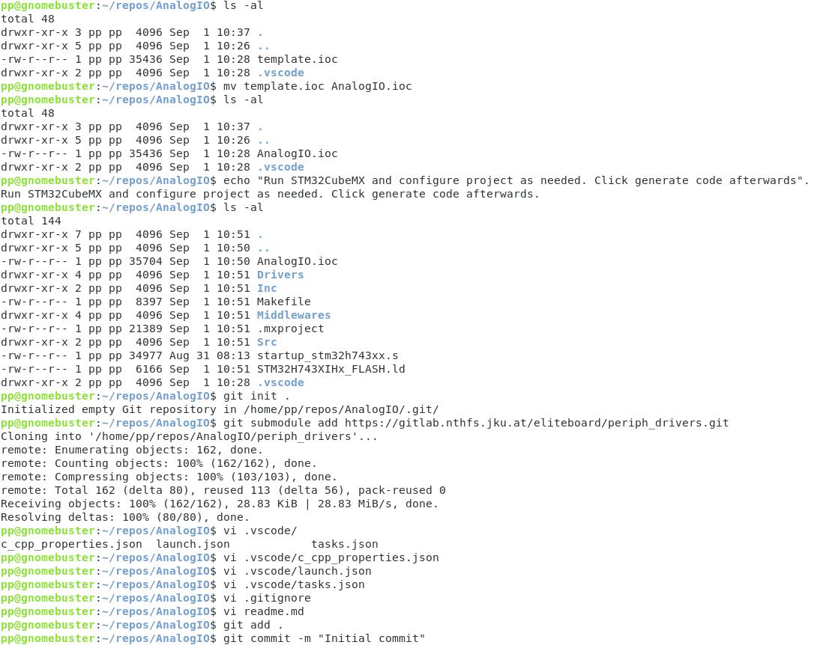

# Eliteboard C-Project Template
This template contains all files required for setting up a new C project for the Eliteboard. 

## Prerequisites
See *Manual installation of the development environment* section [here](https://gitlab.nthfs.jku.at/eliteboard/vscode_c_examples). 

## Usage
1. Copy `.vscode/` and `template.ioc` from this folder to your new project's directory.
2. Rename `template.ioc` to `<project-name>.ioc`, according to your new project's name.
3. Open `<project-name>.ioc` in [STM32CubeMX](https://www.st.com/en/development-tools/stm32cubemx.html#get-software).
4. *If required*, adapt the project settings within STM32CubeMX. 
   By default, most peripherals are enabled and routed to pins, LwIP and FatFs are enabled and the clock tree is properly set-up. 
   It is recommended to migrate the project to the newest STM library on initial project set-up. 
   It is also recommended to use the code-generation settings depicted below. 
   
5. In STM32CubeMX, click `Generate code`. 
   This will copy all required dependencies to your project folder and generate a Makefile and a `main.c`.[^1]
6. *If required*, initialize an empty git repository in the project folder with `git init`.
7. *If required*, add `periph_drivers` submodule to the repository with `git submodule add https://gitlab.nthfs.jku.at/eliteboard/periph_drivers.git`.
8. Open `.vscode/launch.json` and adapt `configurations.executable` and `configurations.<your-os>.BMPGDBSerialPort` according to the project name and your attached Eliteboard's BMP-COM-Port.
9. *If required*, create `.gitignore` and `readme.md` ...
10. *If required*, stage files in git with `git add .` and issue the initial commit with `git commit -m 'Initial commit'`.
11. Open your new project's folder in VSCode. Press `Ctrl`+`Shift`+`B` to compile the empty project.

## Example (Debian)

## Notes
- In Windows it might be necessary to create a folder `build` within your project directory.
- To include own header and source files, as well as precompiled static libraries you have to add them to the Makefile manually. Add additional include paths to `configurations.includePath` as well in `.vscode\c_cpp_properties.json`.

[^1]: To change settings later, repeat steps 4 and 5. If this leads to compiler errors, make sure that `C_SOURCES` and `C_INCLUDES` sections in the Makefile do **not** end with a duplicated line separated by a *newline without backslash*.
